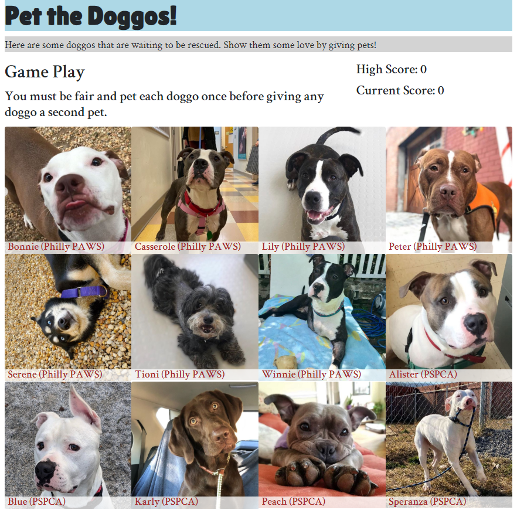

# pet-the-doggos
#### There are 12 and you must pet each doggo once before giving any doggo a second pet.

* [Deployed](http://jshou403.github.io/pet-the-doggos)
* [Repository](https://github.com/jshou403/pet-the-doggos)

## How The App Works 
This single-page game is built with React.js uses Create React App for initial set up. Once the page loads, the user is shown 12 images of dogs. The goal of the game is to click on each of the 12 dogs just once. Once a dog is clicked, all the images shuffle and if the dog has not been clicked yet, the score increases by 1; if the dog has already been clicked the current score resets to 0. 

## Technologies Used
* React.js
* JSX
* Javascript 
* Bootstrap
* CSS3

## Developer
Jacalyn Shou 
* [Portfolio](http://www.jacalynshou.com/)
* [Github](https://github.com/jshou403)
* [LinkedIn](https://www.linkedin.com/in/jacalyn-shou/)